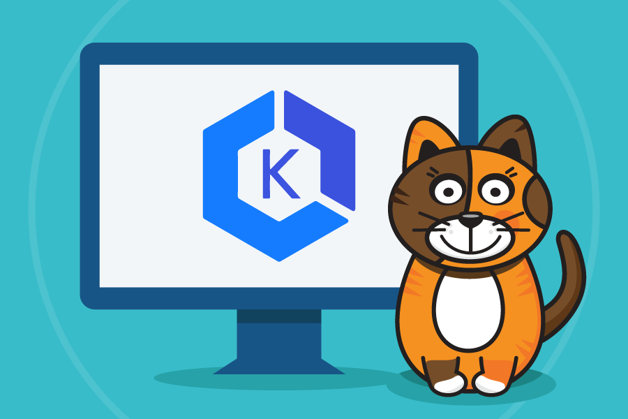

# Calico Microsegmentation

## Workshop objectives

The intent of this workshop is to educate any person working with Kubernetes in one way or another about Calico features and how to use them. While there are many capabilities that Calico provides, this workshop focuses on Microsegmentation use case.

## Use cases

In this workshop we are going to focus on these main use cases:

- **East-West security**, leveraging zero-trust security approach.
- **Egress access controls**, using DNS policy to access external resources by their fully qualified domain names (FQDN).
- **Host micro-segmentation**, leveraging Calico policies to protect host ports and host based services.

## Join the Slack Channel

[Calico User Group Slack](https://slack.projectcalico.org/) is a great resource to ask any questions about Calico. If you are not a part of this Slack group yet, we highly recommend [joining it](https://slack.projectcalico.org/) to participate in discussions or ask questions. For example, you can ask questions specific to EKS and other managed Kubernetes services in the `#eks-aks-gke-iks` channel.

## Modules

- [Module 1: Configuring demo applications](modules/configuring-demo-apps.md)
- [Module 2: Using security controls](modules/using-security-controls.md)
- [Module 3: Using egress access controls](modules/using-egress-access-controls.md)
- [Module 4: Securing EKS hosts](modules/securing-heps.md)
- [Module 5: Using observability tools](modules/using-observability-tools.md)

