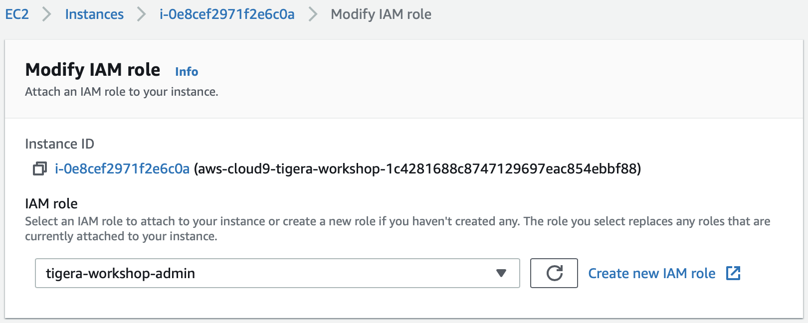

# Module 1: Setting up work environment

**Goal:** Set up and configure your environment to work with AWS resources.

## Choose between local environment and Cloud9 instance

The simplest ways to configure your working environment is to either use your local environment, i.e. laptop, desktop computer, etc., or create an [AWS Cloud9 environment](https://docs.aws.amazon.com/cloud9/latest/user-guide/tutorial.html) from which you can run all necessary commands in this workshop. If you're familiar with tools like `SSH client`, `terraforrm`, and feel comfortable using your local shell, then go to the next section.

To configure a Cloud9 instance, open AWS Console and navigate to `Services` > `Cloud9`. Create environment in the desired region. You can use all the default settings when creating the environment, but consider using `t3.small` instance as the `t2.micro` instance could be a bit slow. It usually takes only a few minutes to get the Cloud9 instance running.

## Steps

1. Ensure your environment has these tools:

    - [AWS CLI](https://docs.aws.amazon.com/cli/latest/userguide/cli-chap-install.html)
    - [Git](https://git-scm.com/book/en/v2/Getting-Started-Installing-Git)
    - [eksctl](https://docs.aws.amazon.com/eks/latest/userguide/eksctl.html)
    - [EKS kubectl](https://docs.aws.amazon.com/eks/latest/userguide/install-kubectl.html)
    - `jq` utility

    Check whether these tools already present in your environment. If not, install the missing ones.

    ```bash
    # run these commands to check whether the tools are installed in your environment
    aws --version
    git --version
    eksctl version
    kubectl version --client

    # install jq
    sudo yum install jq -y
    jq --version
    ```

    >For convenience consider configuring [autocompletion for kubectl](https://kubernetes.io/docs/tasks/tools/included/optional-kubectl-configs-bash-linux/#enable-kubectl-autocompletion).

2. Download this repo into your environment:

    ```bash
    git clone https://github.com/tigera-solutions/tigera-eks-workshop  
    ```

3. Configure AMI role for Cloud9 workspace.

    >This is necessary when using Cloud9 environment which has an IAM role automatically associated with it. You need to replace this role with a custom IAM role that provides necessary permissions to build EKS cluster so that you can work with the cluster using `kubectl` CLI.

    a. Create IAM role.

    ```bash
    # go to cloned repo
    cd ./tigera-eks-workshop

    IAM_ROLE='tigera-workshop-admin'
    # assign AdministratorAccess default policy. You can use a custom policy if required.
    ADMIN_POLICY_ARN=$(aws iam list-policies --query 'Policies[?PolicyName==`AdministratorAccess`].Arn' --output text)
    # create IAM role
    aws iam create-role --role-name $IAM_ROLE --assume-role-policy-document file://configs/trust-policy.json
    aws iam attach-role-policy --role-name $IAM_ROLE --policy-arn $ADMIN_POLICY_ARN
    # tag role
    aws iam tag-role --role-name $IAM_ROLE --tags '{"Key": "purpose", "Value": "tigera-eks-workshop"}'
    # create instance profile
    aws iam create-instance-profile --instance-profile-name $IAM_ROLE
    # add IAM role to instance profile
    aws iam add-role-to-instance-profile --role-name $IAM_ROLE --instance-profile-name $IAM_ROLE
    ```

    b. Assign the IAM role to Cloud9 workspace.

    - Click the grey circle button (in top right corner) and select `Manage EC2 Instance`.

        

    - Select the instance, then choose `Actions` > `Security` > `Modify IAM Role` and assign the IAM role you created in previous step, i.e. `tigera-workshop-admin`.

        

    c. Update IAM settings for your workspace.

    - Return to your Cloud9 workspace and click the gear icon (in top right corner)
    - Select AWS SETTINGS
    - Turn off AWS managed temporary credentials
    - Close the Preferences tab

        

[Next -> Module 2](../modules/creating-eks-cluster.md)
